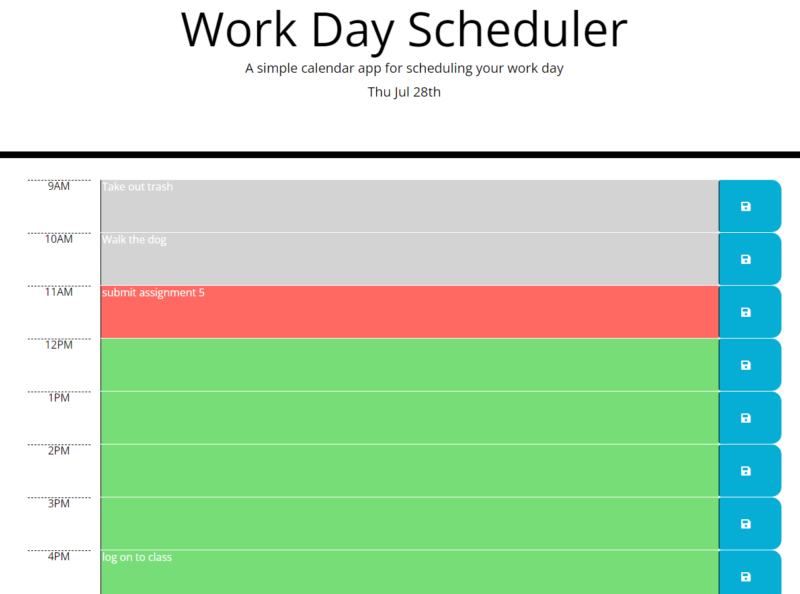

# Work Day Scheduler

## Table of contents

- [Overview](#overview)
 - [The challenge](#the-challenge)
  - [User Story](#user-story)
  - [Acceptance Criteria](#acceptance-criteria)
  - [Screenshot](#screenshot)
  - [Links](#links)
- [My process](#my-process)
  - [Built with](#built-with)
  - [What I learned](#what-i-learned)
- [Author](#author)


## Overview

### The challenge

This app uses CSS, HTML, and Javascript to create a password based on criteria the user specifies. The user can indicate the password length, characters types, such as alphanumeric or special characters. It also handles exception to prevent user errors during prompt input.

### User Story

AS AN employee with a busy schedule
I WANT to add important events to a daily planner
SO THAT I can manage my time effectively

### Acceptance Criteria

GIVEN I am using a daily planner to create a schedule
WHEN I open the planner
THEN the current day is displayed at the top of the calendar
WHEN I scroll down
THEN I am presented with timeblocks for standard business hours
WHEN I view the timeblocks for that day
THEN each timeblock is color coded to indicate whether it is in the past, present, or future
WHEN I click into a timeblock
THEN I can enter an event
WHEN I click the save button for that timeblock
THEN the text for that event is saved in local storage
WHEN I refresh the page
THEN the saved events persist

### Screenshot



### Links

- Solution URL: [Prefessional README Generator](https://github.com/Monkonjay/Password-Generator.git)
- Live Site: [Test the Project](https://monkonjay.github.io/Password-Generator/)

## My process

### Built with

- Javascript
- CSS
- HTML5
- Bootstrap 5
- Moments


### What I learned

I learned how to format time using moments.js.  It was exciting working with Bootstrap classes and customizing them for my particular application. 


```Javascript
generateBtn.addEventListener("click", writePassword);
```


## Author

- Website - [Robert M Greene]( https://monkonjay.github.io/Portforlio-Page/)
- Github - [Monkonjay](https://github.com/Monkonjay)


